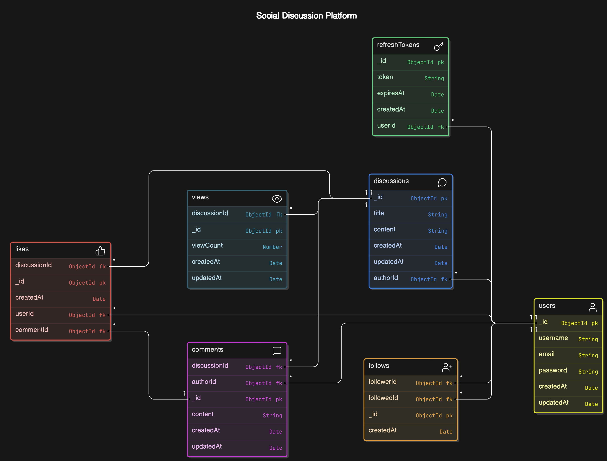
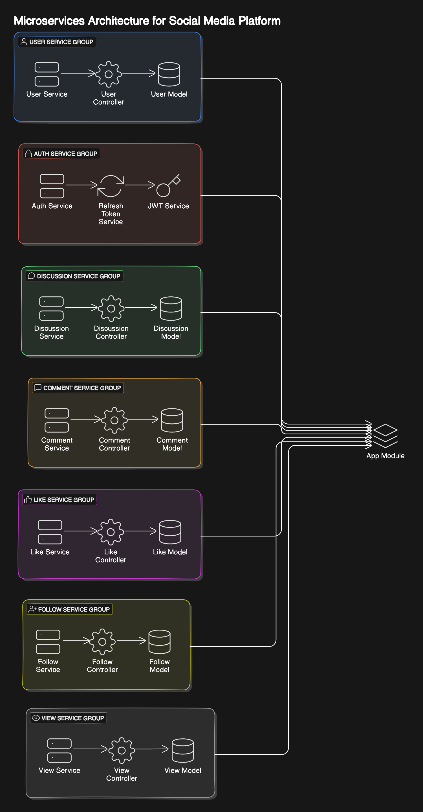
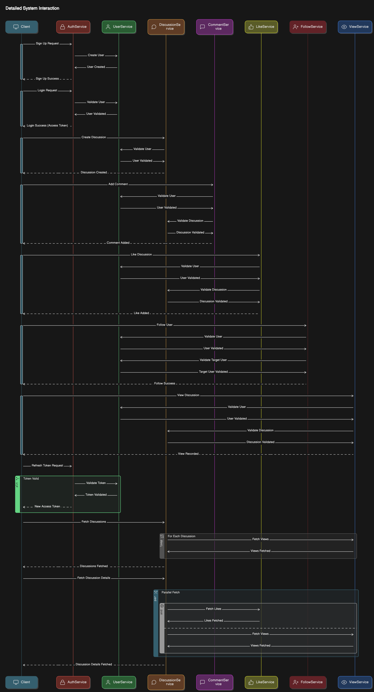

# Social Media API

This is a social media backend API project built using NestJS. The API supports functionalities like user management, discussions, comments, likes, follows, and view counts.

## Features

- User authentication (Signup/Login)
- CRUD operations for Users
- CRUD operations for Discussions
- CRUD operations for Comments
- Like/Unlike Discussions and Comments
- Follow/Unfollow Users
- View count for Discussions
- Search Users by name
- Search Discussions by text or hashtags

## Technologies Used

- Node.js
- NestJS
- MongoDB
- Mongoose
- JWT for authentication
- Swagger for API documentation

## Installation

1. Clone the repository:
    ```bash
    git clone <https://github.com/devnayyar/Social_media.git>
    ```

2. Install dependencies:
    ```bash
    npm install
    ```

3. Set up environment variables:

   Create a `.env` file in the root directory and add the following variables:
    ```dotenv
    MONGODB_URI=<your-mongodb-uri>
    JWT_SECRET=<your-jwt-secret>
    ```

## Running the Application

1. Start the NestJS application:
    ```bash
    npm run start
    ```

2. The API will be available at `http://localhost:3000`.

3. Swagger API documentation will be available at `http://localhost:3000/api`.

    ```bash
    console.log('Swagger API documentation is available at: http://localhost:3000/api');
    ```

## API Endpoints

### Auth

- `POST /auth/signup` - Sign up a new user
- `POST /auth/login` - Log in a user
- `POST /auth/refresh-token` - Refresh authentication token

### Users

- `POST /users` - Create a new user
- `GET /users` - Get a list of users
- `GET /users/:id` - Get a user by ID
- `PUT /users/:id` - Update a user by ID
- `DELETE /users/:id` - Delete a user by ID
- `GET /users/search/:name` - Search users by name

### Discussions

- `POST /discussions` - Create a new discussion
- `GET /discussions` - Get a list of discussions
- `GET /discussions/:id` - Get a discussion by ID
- `PATCH /discussions/:id` - Update a discussion by ID
- `DELETE /discussions/:id` - Delete a discussion by ID
- `GET /discussions/hashtag/:hashtag` - Get discussions by hashtag
- `GET /discussions/search` - Search discussions by text

### Comments

- `POST /comments` - Create a new comment
- `GET /comments` - Get a list of comments
- `GET /comments/:id` - Get a comment by ID
- `DELETE /comments/:id` - Delete a comment by ID

### Likes

- `POST /likes` - Like a discussion or comment
- `GET /likes` - Get a list of likes
- `GET /likes/:id` - Get a like by ID
- `DELETE /likes/:id` - Delete a like by ID

### Follows

- `POST /follow` - Follow a user
- `DELETE /follow` - Unfollow a user
- `GET /follow/follower/:id` - Get followers of a user
- `GET /follow/followed/:id` - Get users followed by a user

### Views

- `PUT /views/:id/increment` - Increment view count of a discussion
- `GET /views/:id` - Get view count of a discussion

## Diagrams

### Schema



### Low-Level Design



### System interaction


## Testing

1. To test the API endpoints, you can use the provided Postman collection. Import the collection into Postman and use the predefined requests to test the functionality.

## Contributing

1. Fork the repository
2. Create your feature branch (`git checkout -b feature/your-feature`)
3. Commit your changes (`git commit -am 'Add some feature'`)
4. Push to the branch (`git push origin feature/your-feature`)
5. Create a new Pull Request

## License

This project is licensed under the MIT License.
